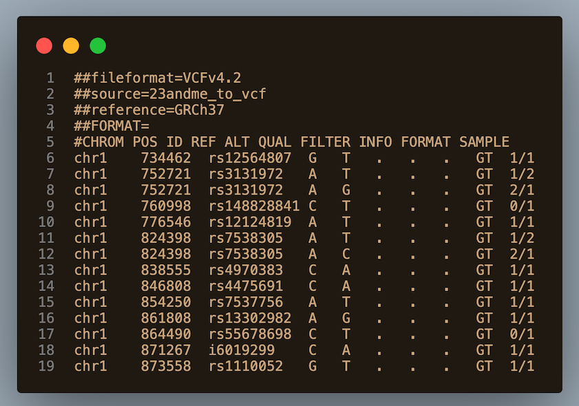

# 23andme to VCF

A simple command-line tool to convert 23andMe raw data files to VCF format.

# Install
```
pip install 23andme-to-vcf
```

# Usage

```
23andme-to-vcf --input in.txt --fasta GRCh37.fa --fai GRCh37.fa.fai --output out.vcf
```

Alternatively, run the public docker image `davidwb/23andme-to-vcf` which already contains the reference and fasta index:

```
docker run -v `pwd`:/app/data davidwb/23andme-to-vcf --input genome_David_Brown_v4_Full_20180518133503.txt --output david_23andme.vcf
```

------------------------------------------------------------------  
# UPDATE
This repository was forked from the original at . 

## What's different?

1. Removed duplicate output if the individual's genotype (GT) is heterozygous for alternative (ALT) alleles.  
2. Added the ability to list two alleles in the ALT column.  
3. Added output if the individual's GT is homozygous for the reference (REF) genome.

Point 1 clarifies output. Previously a heterozygous condition would return two lines that would be identical except for the order of the output in the SAMPLE column: one line would have the order 1/2 and the second line would have the order 2/1.

Point 2 adds information that is useful for analysis and conforms to the defined VCF file format as described in documentation for VCF v 4.2 (which is the format used in this code). Note that this spec has since been superseded by more recent versions, however the spec still contains information about heterozygous, non-REF alleles in the ALT column.

Point 3 has been added since genotypes that are homozygous for REF (i.e. GT 0/0) are shown in the VCF file format spec, even though, in theory, homozygosity for the reference genome isn't necessarily **variant**. It can be argued that the non-variant alleles can be excluded. However, I prefer not losing any information from the original data as it could raise questions down the line (e.g. Were these alleles called at all? Were they deleted?)

## Output with original code  


## Output with adjusted code 


